# 📇 Jekyll Theme Manpage

[](https://app.netlify.com/sites/jekyll-theme-manpage/deploys)
<a href="https://jekyll-themes.com/drshika/jekyll-theme-manpage">
  
</a>

A minimalist Jekyll theme inspired by Linux man pages. Perfect for personal websites, portfolios, and blogs with a technical focus.

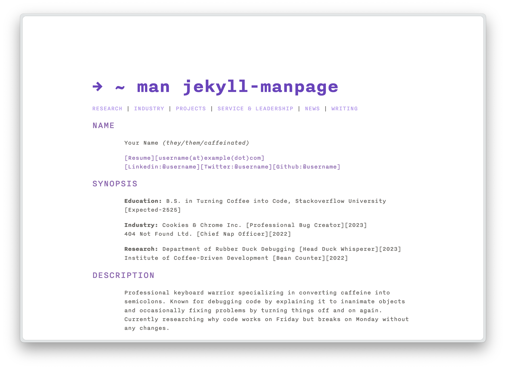

## Features

- 📱 Fully responsive layout
- 🌙 Automatic dark mode support
- ✍️ Blog/writing section with:
  - Full-text search
  - Tag filtering
  - Table of contents
  - Reading Time
- 📐 LaTeX and mhChem support for mathematical and chemical expressions
- 🎨 Multiple color skins with light/dark variants
- 🚀 Fast and lightweight
- 🔍 SEO optimized
- 📊 Sitemap generation
- 💬 Giscus comments integration
- 📡 RSS feed support

## Installation

1. Follow the steps to [create repository from template](https://docs.github.com/en/repositories/creating-and-managing-repositories/creating-a-repository-from-a-template#creating-a-repository-from-a-template)

## Usage

### Basic Setup
1. Set any social links you would like to include in `_data/social_links.yml`. You can add as many as you like!
2. News posts are formatted like this:
```
{: .news-header}
[Month, Year]

{: .news}
Text for your news here
```
Additional news posts can be added in the `news-archive.md` file with the same format.    

3. Fun facts can be added in `_data/facts.yml`. The theme will automatically turn this into a linked list for you.   
4. If you would like to add/remove sections from the home page, `_data/navigation.yml` has each page and the link. 
For the links that go to a header on the homepage you can use the name of the header after the home page route: 

*file: index.md*
```markdown
# Section
```
would be   
*file: navigation.yml*
``` yaml
- name: Section
  link: /#section
```
See this [markdown reference](https://garrettgman.github.io/rmarkdown/authoring_pandoc_markdown.html#headers) for more guidance on how to figure out the links for your headers.

For links that go to other pages on the site you will most likely have to prefix the page name with `../../`. 
```yaml
- name: Writing
  link: ../../writing.html
```
 

### Writing Posts

Create posts in `_posts` directory following this format:

```markdown
---
layout: post
title: Your Post Title
description: Brief description
tags: [tag1, tag2]
toc: true # Optional table of contents
---
Your content here...
```

Make sure to name the file with the `YYYY-MM-DD-Title.md`. 


### Customization

#### Color Skins

The theme comes with several preset color schemes. You can set the base skin in the `config.yaml` file and the light and dark mode will automatically adapt to whatever the user has set as their preference. 

### Light Mode Variants
| Theme | Preview |
|-------|---------|
| Purple | 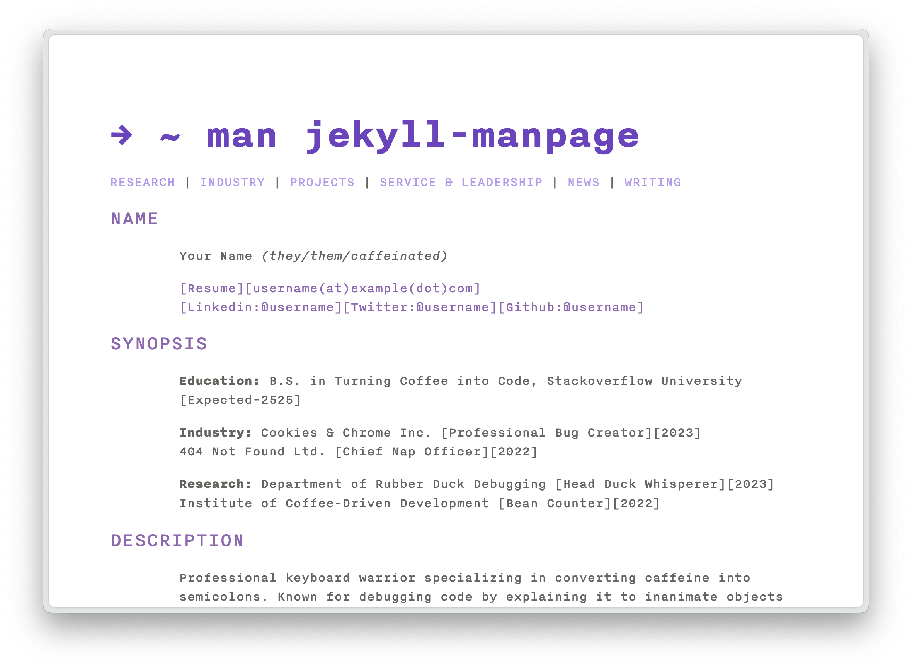 |
| Tomorrow | 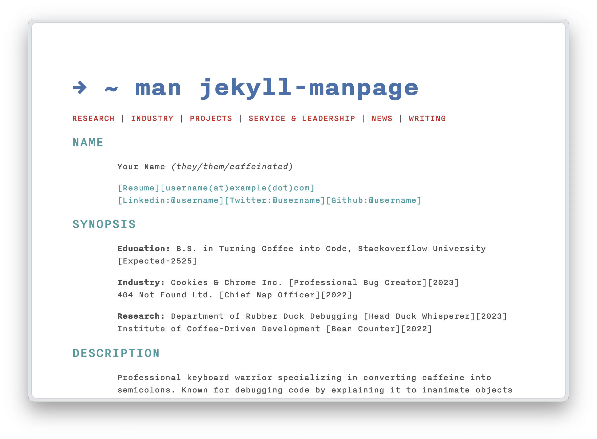 |
| GitHub | 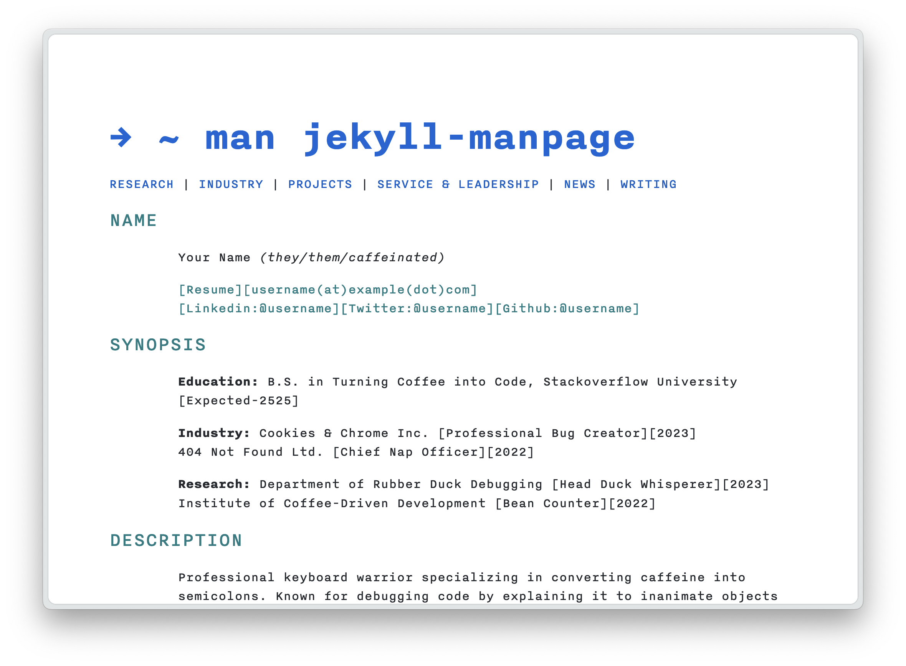 |
| Dracula | 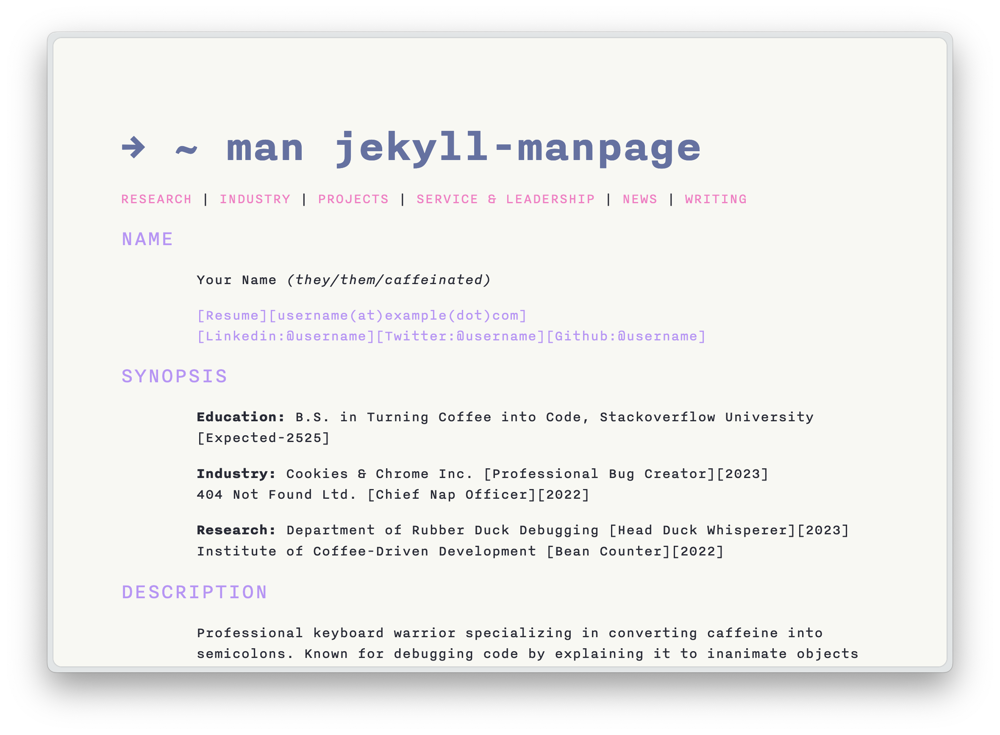 |
| Nord | 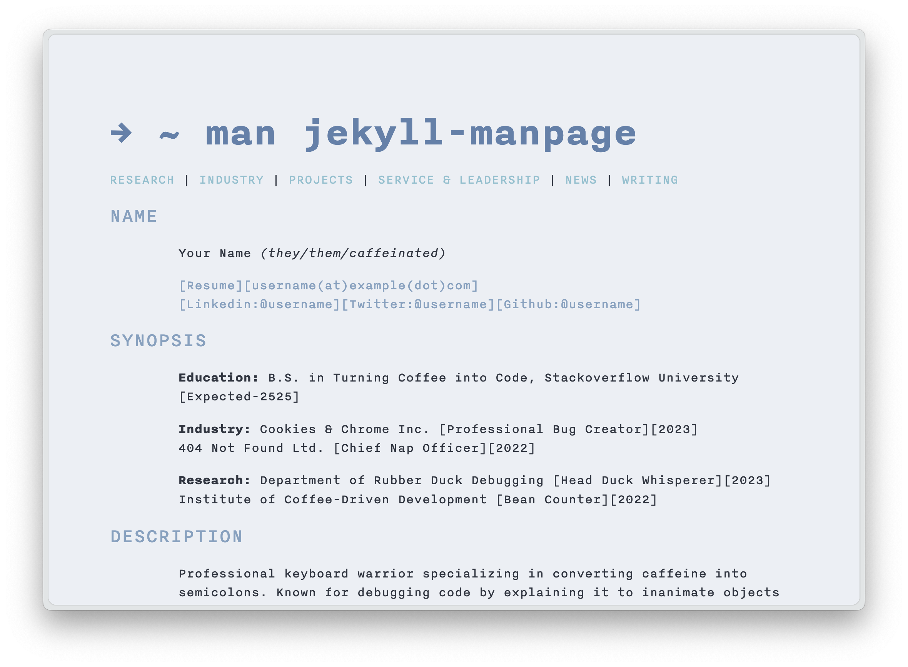 |
| Monokai | 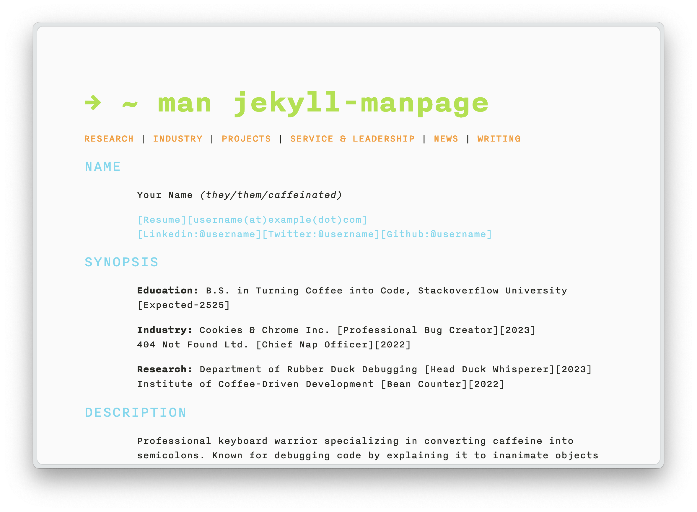 |

### Dark Mode Variants
| Theme | Preview |
|-------|---------|
| Purple | 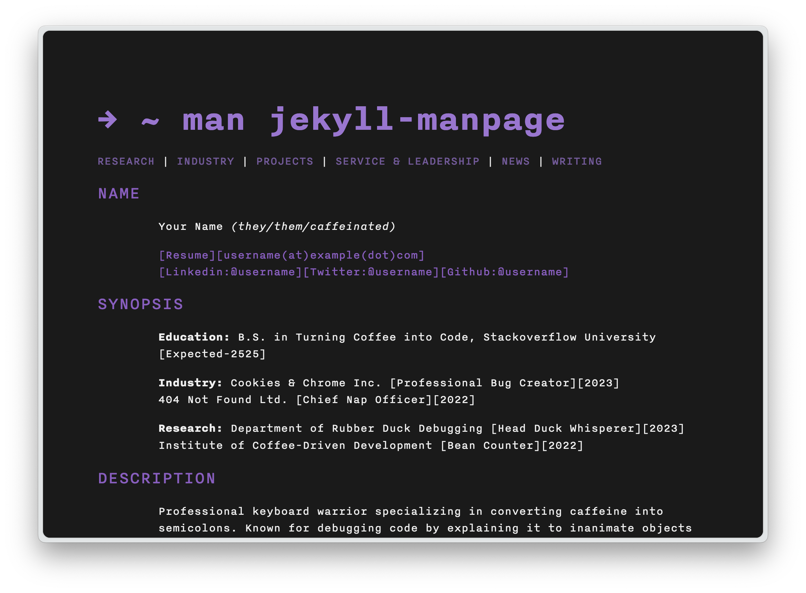 |
| Tomorrow | 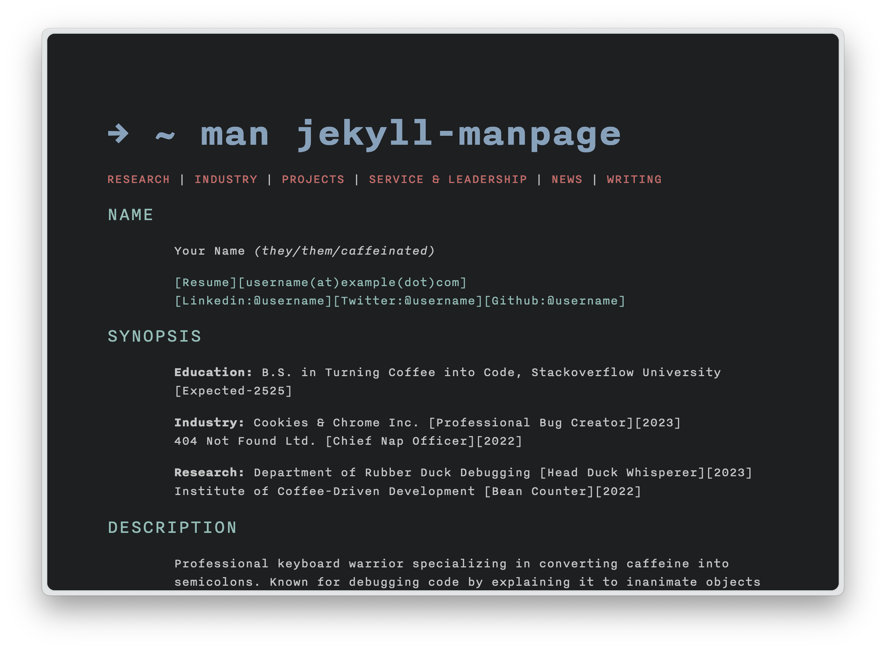 |
| GitHub | 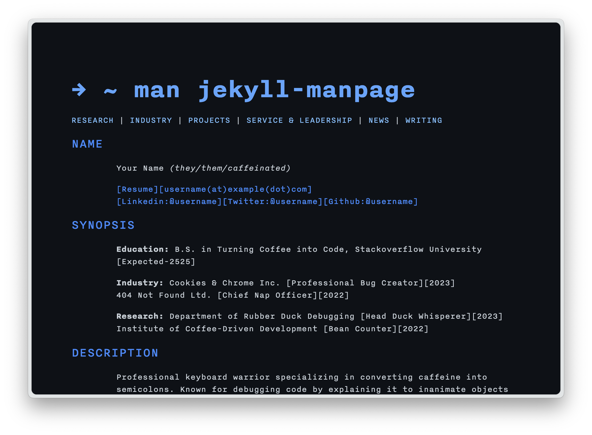 |
| Dracula | 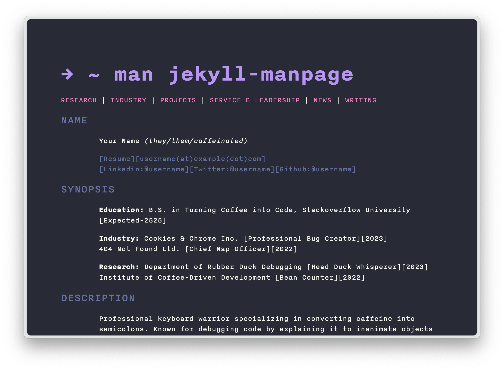 |
| Nord | 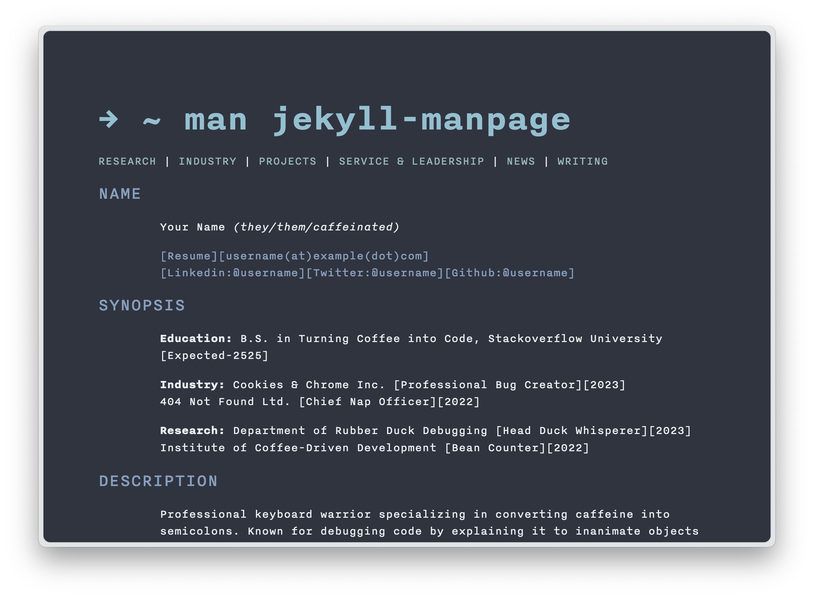 |
| Monokai | 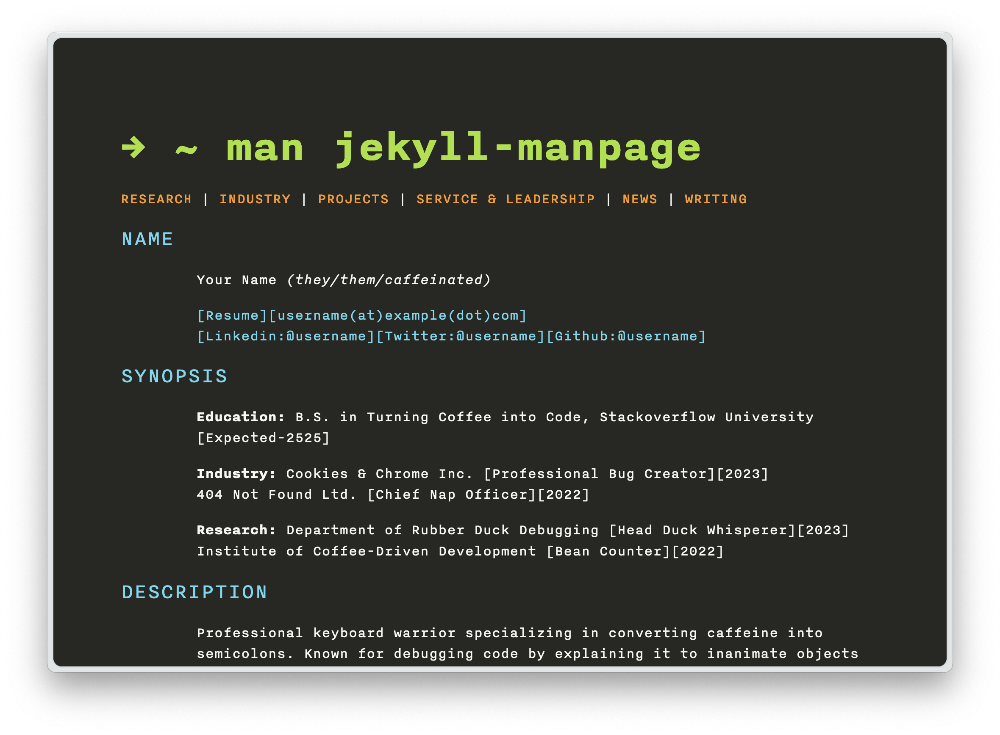 |

#### Typography

This theme uses Nitti as its default font. You can purchase Nitti from [Adobe Fonts](https://fonts.adobe.com/fonts/nitti). If you have purchased the font, you can put it in the `assets/fonts` directory and it should automatically load. 

If you want to use a different font, you will have to change lines 8-35 in `_sass/jekyll-theme-manpage.scss` to import/load the correct font. You will also need to set the default font in `_sass/variables.scss`

```css
// Typography
$font-family-mono: "Nitti", "Source Code Pro", "Inconsolata", monospace;
```

## Development

To set up your environment to develop this theme:

1. Clone this repo
2. Run `bundle install`
3. Run `bundle exec jekyll serve`
4. Visit `http://localhost:4000`

If you want to try out the different skins, you will have to stop and start the bundler each time.

## Optional Features

Enable optional features in your `_config.yml`:

```yaml
features:
  comments: true  # Set to true to enable Giscus comments
  rss_feed: true  # Set to true to enable RSS feed
  search: true  # Set to true to enable search
  google_analytics: false  # Set to true to enable Google Analytics
  tags: true  # Set to true to enable tags
  read_time: true  # Set to true to enable read time
  back_to_top: false  # Set to true to enable back to top button
```

### Comments

To enable comments:

1. Set `features.comments: true` in your `_config.yml`
2. Get your Giscus script from [giscus.app](https://giscus.app)
3. Paste the generated script into `_includes/comments.html`

Disable comments for specific posts by adding `comments: false` to the post's front matter.

### RSS Feed

To enable RSS feed:

1. Set `features.rss_feed: true` in your `_config.yml`

Your feed will be available at `/feed.xml`. See [Jekyll Feed documentation](https://github.com/jekyll/jekyll-feed) for additional configuration options.

## Contributing

Bug reports and pull requests are welcome on GitHub. This project is intended to be a safe, welcoming space for collaboration, and contributors are expected to adhere to the [Contributor Covenant](https://www.contributor-covenant.org/) code of conduct.

## License

The theme is available as open source under the terms of the [MIT License](https://opensource.org/licenses/MIT).

## Credits

Created with ❤️ by Drshika Asher
